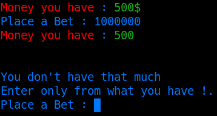
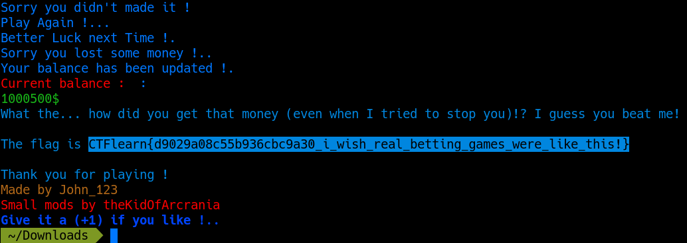

# Binary challenges

## Lazy Game Challenge

This challenge prompts you to connect to a netcat server that is a betting game. Seeing the instructions when connecting to the server, we know that we:
- Start with a value of "500"
- Need to get a value of "1000000"
- Can input numbers
- Can only guess a number between 1 and 10 (still counts as a try)

With this in mind, the first thing we can do is try betting money that we don't have. If we bet more money than we actually have, it does not accept the input.

However, we can still try adding a negative value, as the program might only be checking if the input is less or equal to the amount we have, and not if the value is less than zero. This ends up working, so now the next thing we have to do is intentionally lose, so that it subtracts the negative value we bet, effectively adding any amount we want. Trying to lose by guessing random numbers doesn't actually work (this could be due to internal controls or just bad luck). What we can do to lose is guess numbers over 10. 

The flag to complete this level is `CTFlearn{d9029a08c55b936cbc9a30_i_wish_real_betting_games_were_like_this!}`
