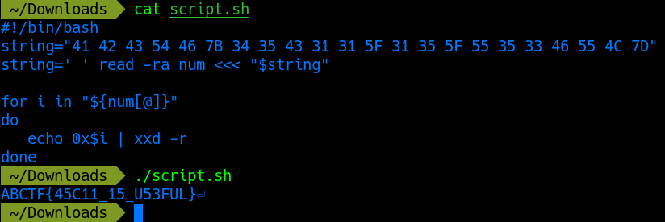

# Cryptography challenges

## Character Encoding

This challenge tells us that the following code `41 42 43 54 46 7B 34 35 43 31 31 5F 31 35 5F 55 35 33 46 55 4C 7D` is ASCII encoded (American Standard Code Information Interchange), so all you would have to do is go find an ASCII table, and decode the string. You can do this manually, or write a simple bash script.

```shell
#!/bin/bash
string="41 42 43 54 46 7B 34 35 43 31 31 5F 31 35 5F 55 35 33 46 55 4C 7D"
string=' ' read -ra num <<< "$string"

for i in "${num[@]}"
do
   echo 0x$i | xxd -r
done
```



The flag for this level is `ABCTF{45C11_15_U53FUL}`

## Hextroadinary

This challenge gives you two hexadecimal bytes `0xc4115` and `0x4cf8`, and gives us a hint as to how to get the flag from the challenge description. If you read the description carefully, you can deduct that the challenge requires us to XOR the two hexadecimal values together. We can do this in the command line using:

```shell
printf '%#x\n' "$((0xc4115 ^ 0x4cf8))"
```

The flag for this level is `0xc0ded`
