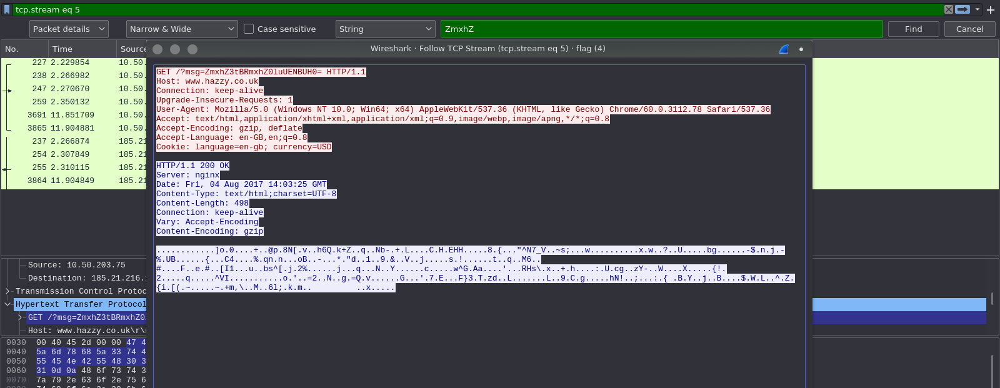
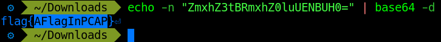
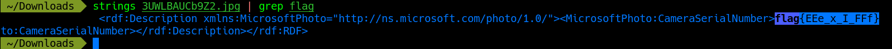

# Forensics challenges

## Forensics 101

This challenge gives us an image. We can look for the flag in the image data using two tools: `xxd` and `strings`. Using `xxd`, we can perform a hexdump on the image, and use `grep` on key terms such as "flag".


Or, we can use `strings` to dump printable character sequences followed by an unprintable character (you can use `grep` here as well).


The flag for this level is `flag{wow!_data_is_cool}`

## Taking LS

This challenge gives us a zip archive containing a pdf file after extracting. When trying to open the pdf file, it prompts us for a password. Considering that this is a forensics challenge (not a cryptography one), we can use the command `ls -al` to see the contents of the current directory, along with hidden files and folders.


We can use this password to unlock the pdf and see the flag.

The flag for this level is `CTFlearn{T3Rm1n4l_is_C00l}`

## Binwalk

This challenge gives us a jpeg image, and a hint as to what tool to use on it. On the image, we can use `binwalk` to look for any hidden embedded data.


From the results, we can soee that there is another image (a png file) starting at byte `153493`. With this information, we can use two tools to extract this file: `dd` and `foremost`. Using `dd`, we can copy only the data starting at byte `153493` and so on, effectively extracting the embedded file. 


Or, we can use `foremost` to extract the embedded file for us and even generate a report.


The flag for this level is `ABCTF{b1nw4lk_is_us3ful}`

## A CAPture Of A Flag

This challenge gives a pcap file to analyze. Opening the file in Wireshark, we can see over 7000 packets, there is now way we can manually look through each and every packet. We can use some filters to cut down on the amount of packets we see, such as `dns`, and `http`. Before applying any filters however, it is a good idea to search for some common keystrings such as `flag` or `ctf`. Doing this yields no results, and the reason for this might be that the flag is encoded. One form of encoding we can use to search for encoded keystrings is base64 encoded strings. 

Base64 encoded keystring "flag"
```shell
echo -n "flag" | base64
```

Truncating the result to not include padding yields two results: a GET request and response. On the request, right click on the packet and select `Follow > HTTP Stream`. Here, we notice that the GET request parameter is a base64 encoded string containing our keystring.



Decode this string and you will get the flag.

```shell
echo -n "ZmxhZ3tBRmxhZ0luUENBUH0=" | base64 -d
```



The flag for this level is `flag{AFlagInPCAP}`

## WOW.... So Meta

This challenge gives us an image to examine. The first thing we should always do is run it through `strings` and `grep` for keywords. Run it through `strings` and `grep` for `flag` to get the flag.



The flag for this level is `flag{EEe_x_I_FFf}`
