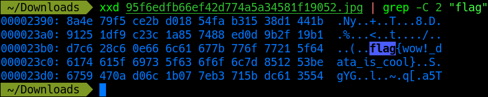
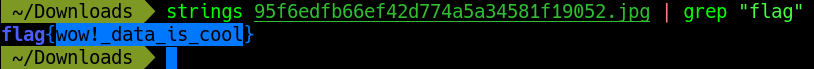
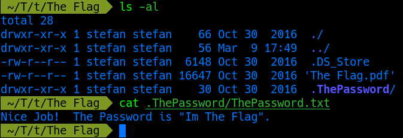
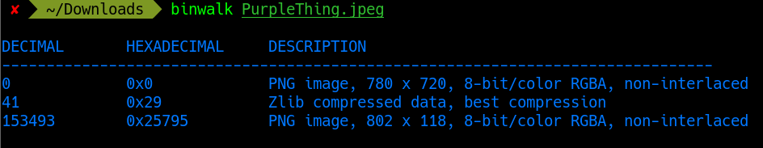
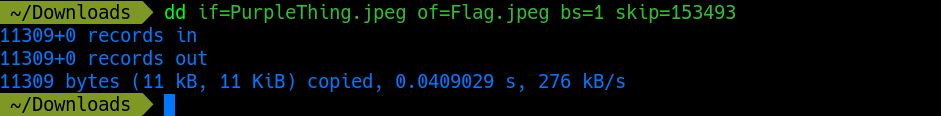
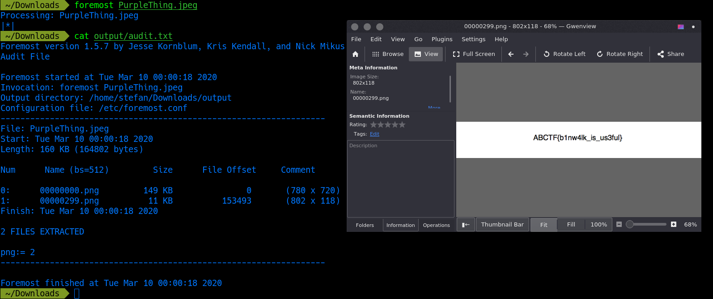

# Forensics challenges

## Forensics 101

This challenge gives us an image. We can look for the flag in the image data using two tools: `xxd` and `strings`. Using `xxd`, we can perform a hexdump on the image, and use `grep` on key terms such as "flag".

Or, we can use `strings` to dump printable character sequences followed by an unprintable character (you can use `grep` here as well).

The flag for this level is `flag{wow!_data_is_cool}`

## Taking LS

This challenge gives us a zip archive containing a pdf file after extracting. When trying to open the pdf file, it prompts us for a password. Considering that this is a forensics challenge (not a cryptography one), we can use the command `ls -al` to see the contents of the current directory, along with hidden files and folders.

We can use this password to unlock the pdf and see the flag.

The flag for this level is `CTFlearn{T3Rm1n4l_is_C00l}`

## Binwalk

This challenge gives us a jpeg image, and a hint as to what tool to use on it. On the image, we can use `binwalk` to look for any hidden embedded data.

From the results, we can soee that there is another image (a png file) starting at byte `153493`. With this information, we can use two tools to extract this file: `dd` and `foremost`. Using `dd`, we can copy only the data starting at byte `153493` and so on, effectively extracting the embedded file. 

Or, we can use `foremost` to extract the embedded file for us and even generate a report.

The flag for this level is `ABCTF{b1nw4lk_is_us3ful}`
