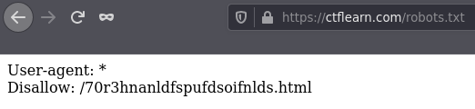
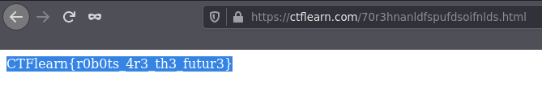
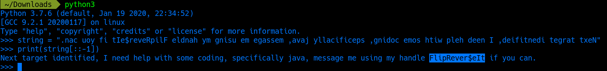
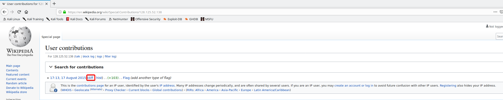
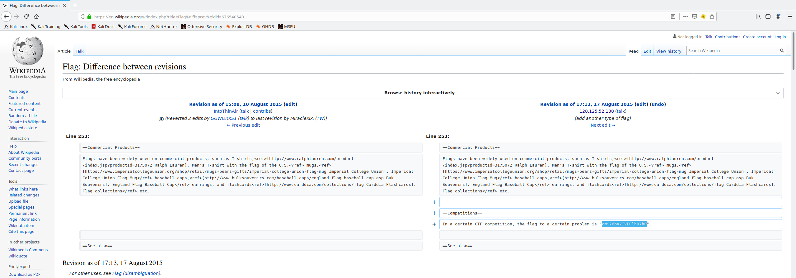
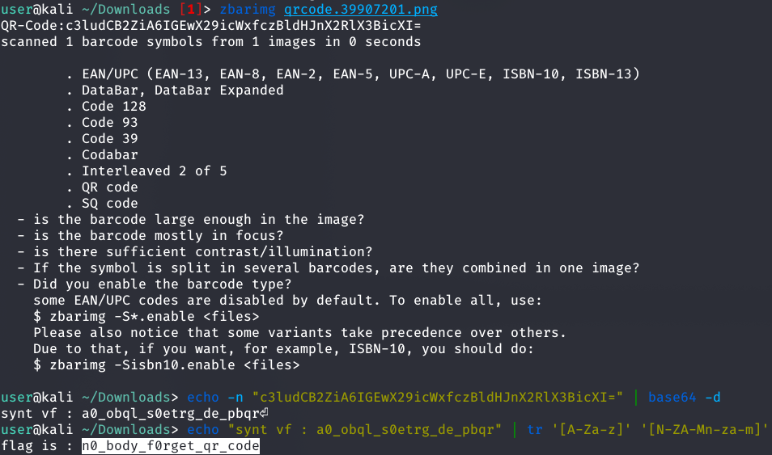
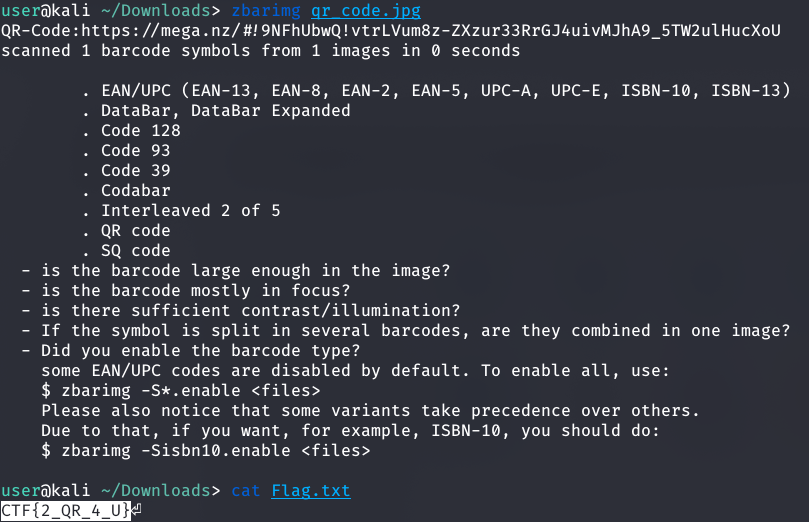

# Miscellaneous challenges

## Where Can My Robot Go?

This challenge hints us at looking at this web sites [robots.txt file](https://www.robotstxt.org/). We can do this by navigating to `https://ctflearn.com/robots.txt`.



There, we see the directory that ctflearn specifically disallowed the directory `/70r3hnanldfspufdsoifnlds.html`. Navigating to this directory gives us the flag. 

 

The flag for this level is `CTFlearn{r0b0ts_4r3_th3_futur3}`

## Reversal of fortune

This challenge gives us a string we have to decode. Looking at the string, we see that its written backwards. We can use a simple Python script to print the sentence backwards.

```python
string = ".nac uoy fi tIe$reveRpilF eldnah ym gnisu em egassem ,avaj yllacificeps ,gnidoc emos htiw pleh deen I ,deifitnedi tegrat txeN"
print(string[::-1])
```



The flag for this level is `CTFlearn{FlipRever$eIt}`

## Wikipedia

In this challenge, all we are given is: Wikipedia, and 128.125.52.138. This looks like an IP address, and how it is relevant with Wikipedia, is that on Wikipedia you can search for contributions made by people identified by their IP addresses. Just go to [Wikipedia](https://www.wikipedia.org/) and search for the IP address. 

After searching you will notice that there has been one contribution made by someone with the matching IP address. You can look at what they contributed by clicking the "diff" link. 



Here, we can find the flag. 



The flag for this level is `CTFlearn{cNi76bV2IVERlh97hP}`

## QR Code

In this challenge we are given a QR code. We can scan it and see a base64 encoded string. Decoding this string gives us a ROT13 encoded string. We can decode this string and get the flag. 



The flag for this level is `CTFlearn{n0_body_f0rget_qr_code}`

## QR Code v2

In this challenge we are given a QR code. We can scan it, and see a *Mega* link. Go to the *Mega* and download the `txt` file. The `txt` file contains the flag. 



The flag for this level is `CTF{2_QR_4_U}`