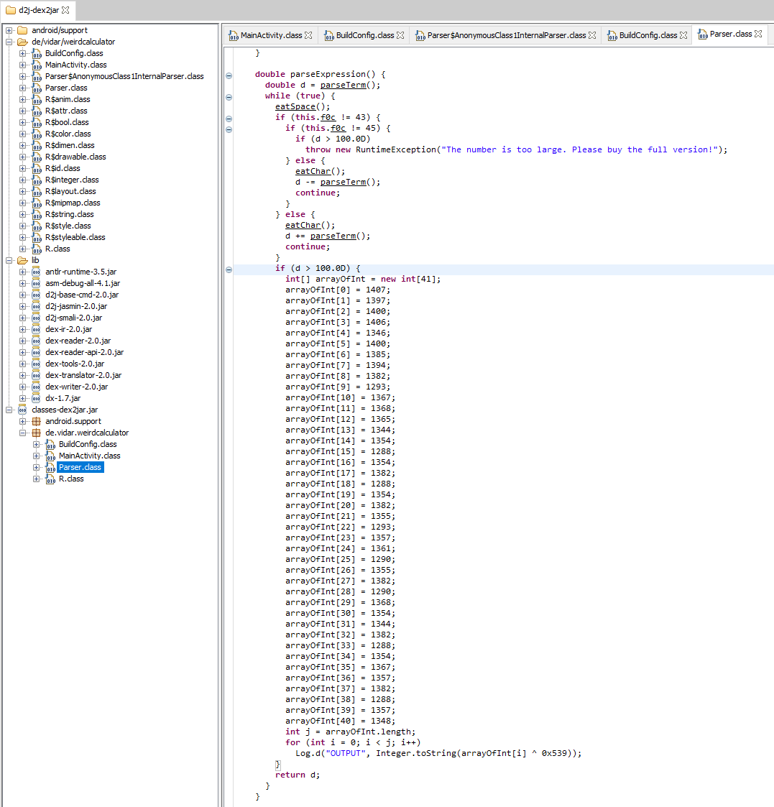
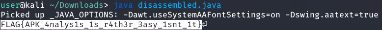

# Programming challenges

## Simple Programming 

This challenge gives us a `.dat` file while a bunch a lines with ones and zeros. The goal outlined in the challenge is to count the number of lines that contain multiples, so the best way to achieve this would be to use [modulos](https://en.wikipedia.org/wiki/Modulo_operation). I wrote the script using Python.

SimpleProgramming.py
```python
#!/usr/bin/python3

line_num = 0 # Keep track of the number of lines counted.

data_file = open("data.dat", 'r') # Open the .dat file for reading.
for line in data_file: # Iterate through each line in the file
    zero_counter = 0 # Keep track of the number of zero's in the line (is reset with every new line)
    one_counter = 0 # Keep track of the number of one's in the line (is reset with every new line)
    for character in line: # Iterate through each character in the line 
        if character == '0':
            zero_counter += 1
        elif character == '1': 
            one_counter += 1
    if (zero_counter % 3 == 0) or (one_counter % 2 == 0): # Check if the amount of zeros is a multiple of three, or if the amount of zeroes is a multiple of 2
        line_num += 1
print(line_num)
```

The flag for this level is `6662`

## Weird Android Calculator

This challenge gives us an `.apk` file, since it is an android app. The challenge also states that we don't need an Android device to get the flag, so getting an emulator won't be necessary. What we can first do with an `.apk`, is extract the file contents. 

```shell
$ unzip WeirdCalculator.apk
```

After that, we need to decompile the `classes.dex` file. You can use [d2j-dex2jar](https://github.com/pxb1988/dex2jar) to convert the `.dex` file into a `.jar`. Then, we can open the `.jar` file using a [Java decompiler](http://java-decompiler.github.io/). Once decompiled, start looking through the classes. Eventually, you should reach `Parser.class` which includes a strange snippet of code. 



Instead of satisfying the `if (d > 100.0D)` statement, we can take all of the Java code inside of it, and run it separately to see what the output is. We can create a file `disassembled.java` with the following code.

```Java
public class Main
{
    public static void main(String[] args)
    {
        int[] arrayOfInt = new int[41];
        arrayOfInt[0] = 1407;
        arrayOfInt[1] = 1397;
        arrayOfInt[2] = 1400;
        arrayOfInt[3] = 1406;
        arrayOfInt[4] = 1346;
        arrayOfInt[5] = 1400;
        arrayOfInt[6] = 1385;
        arrayOfInt[7] = 1394;
        arrayOfInt[8] = 1382;
        arrayOfInt[9] = 1293;
        arrayOfInt[10] = 1367;
        arrayOfInt[11] = 1368;
        arrayOfInt[12] = 1365;
        arrayOfInt[13] = 1344;
        arrayOfInt[14] = 1354;
        arrayOfInt[15] = 1288;
        arrayOfInt[16] = 1354;
        arrayOfInt[17] = 1382;
        arrayOfInt[18] = 1288;
        arrayOfInt[19] = 1354;
        arrayOfInt[20] = 1382;
        arrayOfInt[21] = 1355;
        arrayOfInt[22] = 1293;
        arrayOfInt[23] = 1357;
        arrayOfInt[24] = 1361;
        arrayOfInt[25] = 1290;
        arrayOfInt[26] = 1355;
        arrayOfInt[27] = 1382;
        arrayOfInt[28] = 1290;
        arrayOfInt[29] = 1368;
        arrayOfInt[30] = 1354;
        arrayOfInt[31] = 1344;
        arrayOfInt[32] = 1382;
        arrayOfInt[33] = 1288;
        arrayOfInt[34] = 1354;
        arrayOfInt[35] = 1367;
        arrayOfInt[36] = 1357;
        arrayOfInt[37] = 1382;
        arrayOfInt[38] = 1288;
        arrayOfInt[39] = 1357;
        arrayOfInt[40] = 1348;
        int j = arrayOfInt.length;
        for (int i = 0; i < j; i++)
          System.out.print((char)(arrayOfInt[i] ^ 0x539));
    }
}
```

Near the end, make sure to change the `Log.d` statement to have it print out the result of the array xor'd with the hexadecimal number. We can use `System.out.print`, and `char` to convert the result into a character. Running the file should give you the flag. 



The flag for this level is `CTFlearn{APK_4nalys1s_1s_r4th3r_3asy_1snt_1t}`