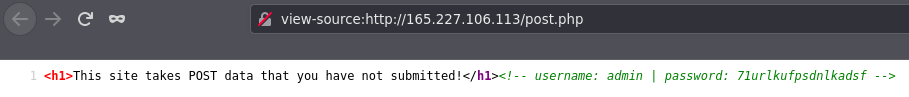

# Web challenges

## Basic Injection

This challenges gives you an input field and you are supposed to SQL inject code that would return a database. Looking in the source code of the page, we there is a comment that tells us to "try some names". 


After trying all the names, only `Luke` seems to work, and it returns a data point named `Data`. With this knowledge, we can reverse engineer the SQL statement that is taking our input.

Regular
```sql
SELECT Name,Data FROM Users WHERE '<input>' ...
```

With this in mind, we can craft out malicious input. The payload that ended up working was `' OR '1' = '1`

Injected
```sql
SELECT Name,Data FROM Users WHERE '' OR '1' = '1' ...
```


The flag for this level is `CTFlearn{th4t_is_why_you_n33d_to_sanitiz3_inputs}`

## POST Practice

Visiting the web page, it tells us that it "this site takes POST data that you have not submitted". Looking at the source code of the page, we can see that it provides us credentials to send along with the POST request.



We can use the command `curl` along with a few parameters to do this and get the flag. 

```shell
curl --request POST "http://165.227.106.113/post.php" --data "username=admin&password=71urlkufpsdnlkadsf"
```


The flag for this level is `CTFlearn{p0st_d4t4_4ll_d4y}`
